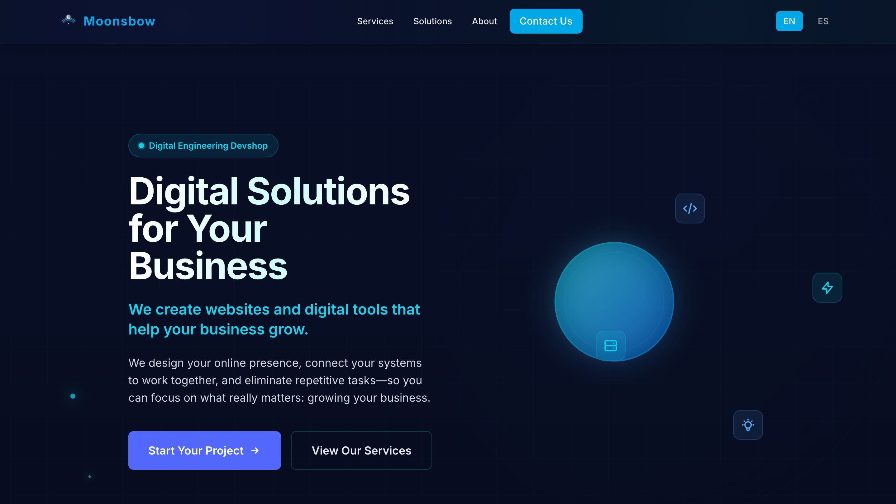

# Projects & Case Studies

## Moonsbow: Digital Engineering & Growth
**Role: Co-Founder & Growth Lead**

{fig-align="center" width="80%"}

* **The Challenge:** Building a devshop that integrates high-performance engineering with strategic marketing.
* **The Solution:** Developed automated social media technology and sales funnel engineering.
* **Impact:** Precision-targeted Google and Meta Ads generating measurable ROI.

<a href="https://www.moonsbow.com/" class="project-link-btn" target="_blank">View Project →</a>

## Total Space Inc.: B2B Brand Migration
**Role: Digital Marketing Associate**

{fig-align="center" width="80%"}

* **The Challenge:** Unifying B2B identity and migrating the brand without losing user engagement.
* **The Solution:** Implemented HubSpot workflows and AI-driven chatbots to optimize the sales funnel.
* **Impact:** Created a seamless user journey across digital platforms.

<a href="https://totalspace-umber.vercel.app/" class="project-link-btn" target="_blank">View Project →</a>

## UB Safety: Tech Stack Migration
**Role: Lead Designer / Developer**

{fig-align="center" width="80%"}

* **The Challenge:** Migrating a legacy site from **WordPress to Astro** to improve performance and SEO.
* **The Solution:** Rebuilt the site architecture using modern web standards for faster loading times and better UX.
* **Impact:** Significant reduction in bounce rate and improved technical SEO rankings.

<a href="https://www.ubsafety.ca/" class="project-link-btn" target="_blank">View Project →</a>

